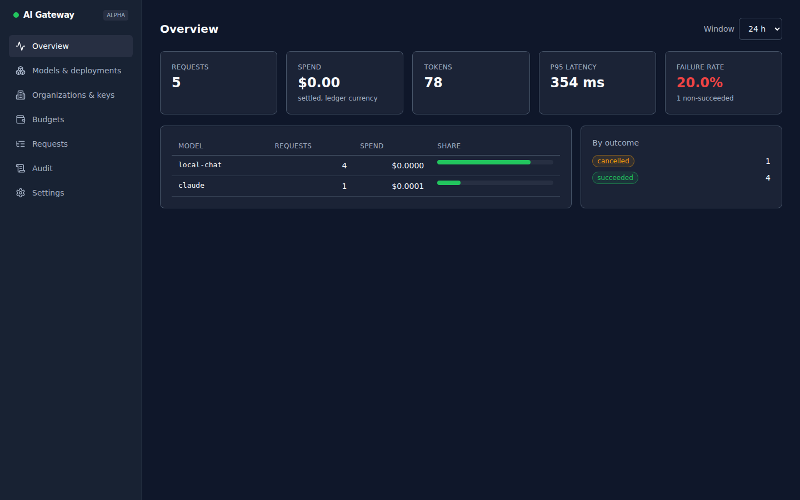

# Independent AI Gateway

Self-hosted AI gateway and management platform with **zero LiteLLM dependency**: our own API contracts, provider
adapters, pricing registry, policy pipeline and data model. Built for local inference first (vLLM / KServe on
Kubernetes) with hosted providers (OpenAI, Anthropic) alongside.

Status: **Phase 1 functional alpha** (see `docs/spec/07-parity-backlog.md`). The specification lives in `docs/spec/`.

## What works today

| Area | Alpha |
|------|-------|
| Inference API | OpenAI-compatible `/v1/chat/completions` (streaming, tools, JSON modes), `/v1/embeddings`, `/v1/models` |
| Providers | `openai_compat` (vLLM, KServe, TGI, Ollama…), `openai`, `anthropic`, `azure_openai`, `gemini` (Vertex AI / Google AI Studio), `bedrock` (Converse, owned SigV4) — direct HTTP, owned translation |
| Tenancy | organizations → teams → projects → virtual keys (hashed, expiry, rotation with grace, revocation ≤ 1 s) |
| Money | PostgreSQL ledger: reserve max cost before dispatch, settle actual after; per org/team/project/key budgets (total/daily/monthly), temporary increases, soft alerts; owned versioned price registry |
| Reliability | capability-aware routing, priority + weighted selection, retries, cooldowns, fallback chains — never after the first client byte; ambiguous outcomes settle conservatively |
| Limits | Valkey RPM/TPM (atomic Lua), documented fail-open/closed |
| Governance | append-only audit log for every control write, per-request diagnostics with routing explanation, usage aggregation, Prometheus metrics |
| Operations | one image, `gateway` / `admin` / `worker` roles; Compose stack with a mock upstream; Helm chart + ArgoCD example; independence gate in CI |

## Portal

The admin role serves the React portal (`portal/`, built with Vite/Tailwind, designed with the vendored
`ui-ux-pro-max` skill): overview, models & deployments, organizations/teams/projects/keys, budgets, request
diagnostics with routing explanations, and the audit log.



## Quick start (local, no external credentials)

```bash
cd deploy/compose
docker compose up -d --build              # postgres, valkey, mock-upstream, migrate+bootstrap, gateway, admin, worker
docker compose logs migrate | grep key:   # the bootstrap virtual key

curl -N localhost:8080/v1/chat/completions \
  -H "authorization: Bearer $KEY" -H 'content-type: application/json' \
  -d '{"model":"local-chat","stream":true,"messages":[{"role":"user","content":"hello"}]}'

curl localhost:8081/admin/v1/overview -H 'x-admin-key: change-me-admin'
open http://localhost:8081            # portal login page: admin key, or Sign in with SSO when Keycloak is configured
```

Portal development: `cd portal && npm install && npm run dev` (proxies `/admin` to `localhost:8081`).

Operations (ports, start/stop, checks, common tasks, troubleshooting): [`docs/runbook.md`](docs/runbook.md).

Load test (docs/spec/06): `python scripts/loadtest.py --key $KEY --requests 500 --concurrency 32 --upstream http://localhost:9000`
reports RPS, TTFB/total p50/p95/p99, error codes and the gateway's *added* latency against the mock upstream; add
`--max-added-p95-ms 25 --max-error-rate 0.01` to fail the run in CI.

Invoice reconciliation (docs/spec/04 §10): import a provider bill (JSON or the CSV every provider export reduces to:
`provider_model, day, amount[, prompt_tokens, completion_tokens]`) and reconcile it against what the ledger settled for
that provider and period, line by line, with amount and token tolerances and the usage the bill forgot.

Guardrails (docs/spec/04 §11): per-project `settings.guardrails` with `pre` (request) and `post` (response) rules —
built-in `pii`, `regex`, `keyword` detectors and an `http` contract for Presidio, LLM Guard or provider moderation —
each `block`, `redact` or `flag`, with timeouts and fail-open/closed. Pre blocks cost nothing; streams are checked
at the tail or fully buffered per policy; every outcome lands in `guardrail_events` and the Requests view.

SCIM 2.0 provisioning (docs/spec/01 §3.4): point Keycloak, Entra ID or Okta at `/scim/v2` with `AIGW_SCIM_TOKEN`;
users become role-binding subjects (deactivation locks them out), groups named `aigw:<role>:<scope>:<id>` grant and
revoke delegated roles as members come and go.

Scheduled key rotation (docs/spec/01 §3.2): give a key `rotate_every_seconds`; the worker rotates it with a grace
period and seals the new plaintext for a single `POST /keys/{id}/pickup` (needs `AIGW_KEY_PICKUP_SECRET`).

Control API with Keycloak (docs/spec/01 §3.1): the `oidc` compose profile starts Keycloak 26 with a dev realm
(roles `aigw-admin` / `aigw-operator` / `aigw-viewer`, client `aigw-portal`, users alice/bob/carol/dan, password = username).

```bash
docker compose --profile oidc up -d keycloak      # console http://localhost:8180 (admin/admin), realm import ~30 s
python ../../scripts/oidc_smoke.py                # tokens for each user → /admin/v1/me, POST org, audit actor check
TOKEN=$(curl -s -d grant_type=password -d client_id=aigw-portal -d username=alice -d password=alice \n  localhost:8180/realms/aigw/protocol/openid-connect/token | jq -r .access_token)
curl localhost:8081/admin/v1/me -H "authorization: Bearer $TOKEN"
```

The portal's login page (`/login`) takes the admin key or *Sign in with SSO* (authorization code + PKCE, no library):
open http://localhost:8081, sign in as `carol` and the write actions disappear; `alice` gets them all. Any
unauthenticated page redirects to `/login?redirect_to=…` and returns there afterwards. The portal reads the
issuer and client id from `GET /admin/v1/auth/config`, so the build carries no environment-specific settings.

Delegated roles (docs/spec/01 §3.2): besides the global Keycloak roles, a user can be bound as *org owner*, *team owner*
or *project member* of one tenant (`POST /admin/v1/role-bindings`, or the *Members* panel on Organizations & keys).
Every control-API route checks the target tenant, and lists are filtered, so a delegate never sees or touches
another organization. Bindings match the token's `sub`, username or email and take effect on the next request.

Active health checks (docs/spec/04 §6): the worker probes every active deployment (`GET …/models`) every 30 s, records
the result in `deployment_health` (shown in the catalog's *Health* column), and after two consecutive failures cools
the deployment down through Valkey so the router skips it before any client request fails; recovery lifts it at once.

Adaptive routing (docs/spec/04 §5.1): inside a priority group the draw weight of each deployment is scaled down by its
time-to-first-byte EWMA, by the vLLM queue depth the worker scrapes from `/metrics` (`capabilities.engine: "vllm"`),
and by the requests this replica already has in flight; `capabilities.max_concurrency` is a hard local admission
limit. Every decision is explained in the request diagnostics (per-candidate signals and scores).

Exact response cache (docs/spec/04 §9): enable per project with `settings.cache = {"enabled": true, "ttl_seconds": 300}`.
Identical requests inside that project (same model, provider and body) are answered from Valkey with a zero-cost
`cached` attempt that still shows in Requests and usage; `X-AIGW-Cache: no-cache` refreshes, `no-store` bypasses.

Point a real deployment at your vLLM/KServe endpoint through the control API:

```bash
curl -X POST localhost:8081/admin/v1/models/<model_id>/deployments -H 'x-admin-key: …' -H 'content-type: application/json' \
  -d '{"name":"vllm-a100","provider":"openai_compat","provider_model":"Qwen/Qwen2.5-32B-Instruct",
       "base_url":"http://vllm.inference.svc:8000/v1","credential_ref":"none","weight":3}'
```

## Development

```bash
pip install -e ".[dev]"
# PostgreSQL 16 (db aigw_test, user aigw/aigw) and Valkey/Redis on localhost, or set AIGW_TEST_DATABASE_URL / AIGW_TEST_VALKEY_URL
pytest -q
python scripts/independence_gate.py
```

CLI: `aigw serve|worker|migrate|bootstrap|verify-restore|price`.

## Layout

```
docs/spec/            Phase 0 specification (contracts, schema, adapters, routing/accounting, deployment, acceptance, backlog)
src/aigw/core         canonical types, errors, pricing, tokens, secrets
src/aigw/adapters     provider adapters (openai_compat, openai, anthropic) + registry
src/aigw/gateway      snapshot, auth, ratelimit, accounting (ledger), router, pipeline, routes, metrics
src/aigw/admin        control API (/admin/v1), audit, admin/OIDC auth
src/aigw/worker       outbox consumer, reconciliation, key expiry
src/aigw/db           SQLAlchemy models, migrations
src/aigw/testing      mock OpenAI/Anthropic upstream
deploy/               Compose, Dockerfile, Helm chart, ArgoCD example
scripts/              independence gate
.claude/skills/       vendored design skills for the portal work (ui-ux-pro-max, design-system, ui-styling)
```

## Independence

No LiteLLM package, proxy, SDK, container, copied adapter code, runtime service, or pricing catalog. `scripts/independence_gate.py`
scans dependencies, source imports, the installed environment, image layers and the SBOM; CI runs it on every change.
LiteLLM's documentation is used only as a reference inventory of feature families (`docs/spec/07-parity-backlog.md`).

## License

Apache-2.0
